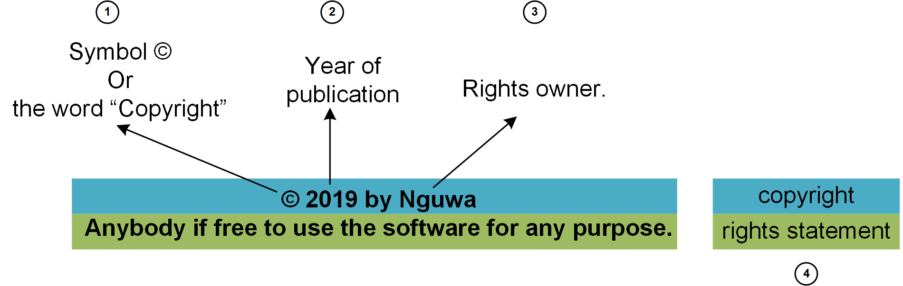

# Software License
## What is it?
A grant of permission to use software. This may include rights to modify and distribute.

## Four parts of a software license

The rights statement **confers rights to individual/entity other than the rights owner.**

# Patent License
## What is it?
Express grant of all patent rights incident to a patent. It **cannot** be revoked.

# Patent Promise
## What is it?
Promise to not enforce patent rights. It can be revoked anytime.

Because it is not bargained for, a patent promise is **NOT** a contract.

# References:

* [John Petersen's Programming Foundations: Open-Source Licensing](https://www.lynda.com/Programming-Foundations-tutorials/Foundations-Programming-Open-Source-Licensing/439414-2.html)
* [Red Hat Patent Promise](https://www.redhat.com/en/about/patent-promise)
