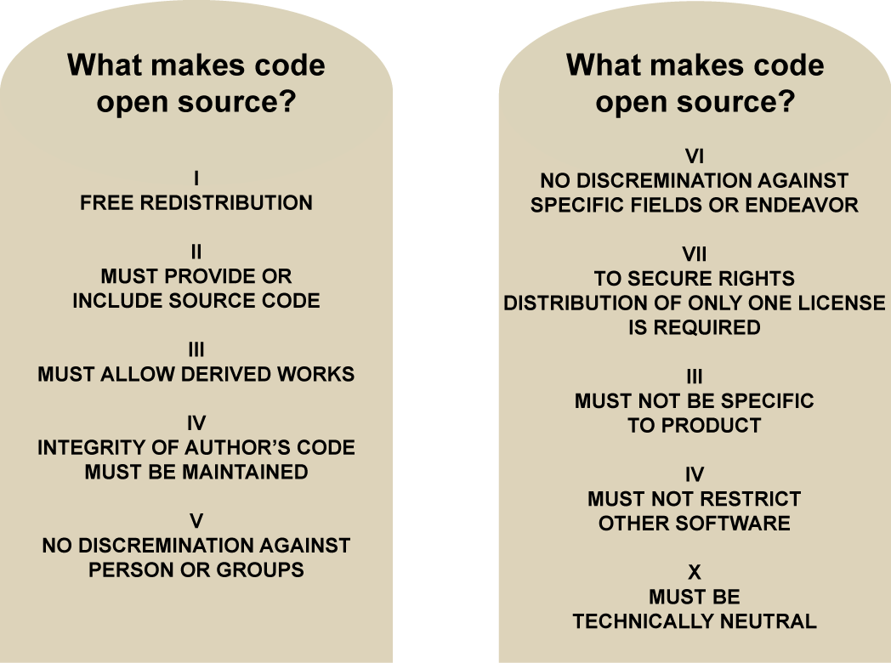

# What makes code open source?
Code access does not make it open source. The key is **what you are able to do with the code**.

# References:

* [John Petersen's Programming Foundations: Open-Source Licensing](https://www.lynda.com/Programming-Foundations-tutorials/Foundations-Programming-Open-Source-Licensing/439414-2.html)
* [The Open Source Definition](https://opensource.org/osd)
